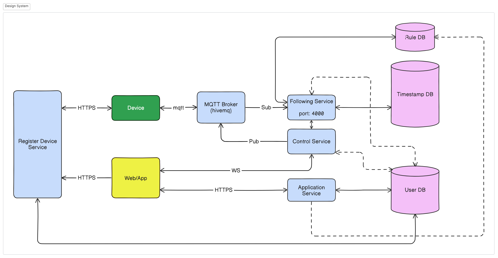
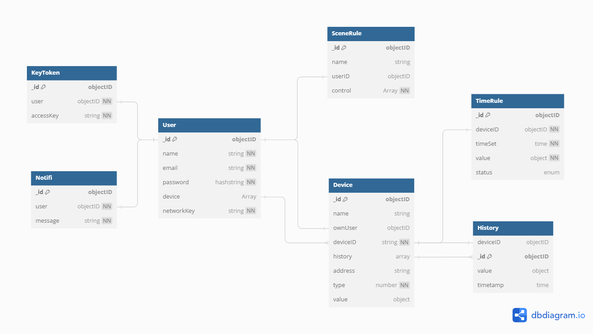

# Cloud Backend
---
## About Cloud project
It's IoT Cloud, communicate with user via API and with device via MQTT. This cloud doesn't include MQTT Broker, you can order free ones in HiveMQ!

## Design System

- Cloud handle 3 services, running on 4 port:
+ Port 3005: Application Service and Register Device Service (Manufactor), where handle User API like: Sign up, Login, Add new device, Config device, Config Rule engine
+ Port 3007: Following Service Port, Listen to mqtt response from MQTT Broker.
+ Port 5000: Listen to control request from user and send mqtt to control device


MongoDB database, using mongoose to connect with.

## Usage
---
#### Starting server:
```bash
node --watch server.js
```

#### Testing API
Test API using VScode Extension `REST Client (humao.rest-client)`:
1. Find API test code at `postman` folder
2. Click to request line (example):
```http
# User signup
POST {{url_dev}}/access/user/signup
Content-Type: application/json

{
    "name":"cuong43113",
    "email":"trinhcuong29743113",
    "password":"1234"
}
```
3. Press `Ctrl + Alt + R`
4. View the result

## Define Device Type

|       Device Type        |      Type     |
|--------------------------|---------------|
|        Switch            |        1      |
|        Sensor            |        2      |

## API Defined
- Manufactor space (__manufactor.post.http__):
    + `Add new device product`
    + `Get info all device`
    + `Get info one device`
    + `Assign device`
- User space:
    + Authentication (__access.post.http__):
        * `Sign up`: New user signup
        * `Login`:
    + Control device (__control.post.http__):
        * `Claim device`: Add device to user profile (Grant access)
        * `Get info all device`
        * `Get info one device`
        * `Control device by deviceID`
    + Control timer (__timer.post.http__):
        * `Create timer for device`
        * `Active timer`
        * `Deactive timer`
    + Control scene (__scene.post.http__):
        * `Set scene`
        * `Active scene`
        * `Remove scene`
- Device space (__device.post.http__):
    + Auto update mqtt to database